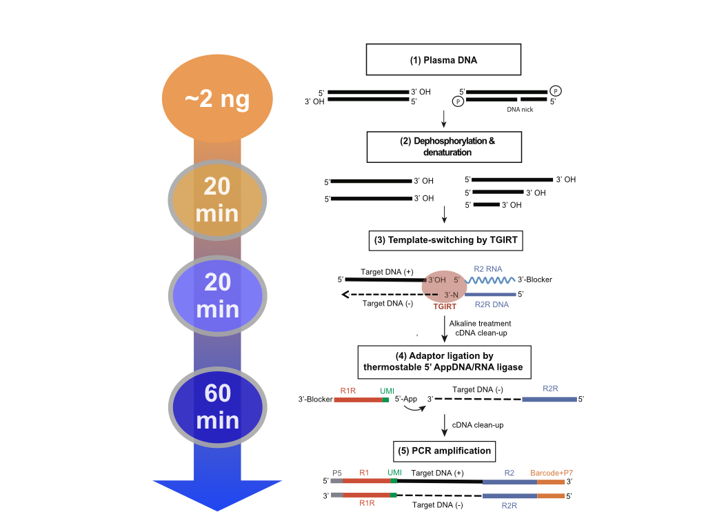
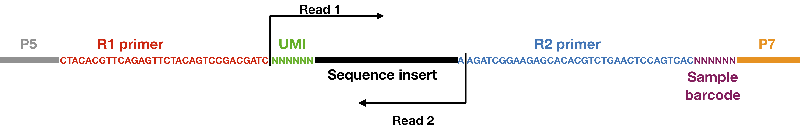

# Overview #

### Procedures ###

### Final sequence structure ###

\newpage

# Reagents for TGIRT-DNA-seq #
## Buffers ##
You can scale up accordingly.

#### DNA TS Buffer I  ####

| Material           |        | Volumn   |       | Final concentration|   
|:---:               |:---:   |:---:     | :---: | :---:              |
| 2M MgCl$_2$        |        | 105 uL   |       | 21 mM              |   
| 2M Tris-HCl pH 7.5 |        | 430 uL   |       | 86 mM              |
| H$_2$O             |        | 9.465 mL |       |                    | 
|  Total             |        | 10 mL    |       |                    |

#### DNA TS Buffer II (420 mM) ####

| Material           |        | Volumn    |       | Final concentration|   
|:---:               |:---:   |:---:      | :---: | :---:              |
| 2.4M NaCl            |        |  8.4 mL   |       | 200uM               |
| 2M MgCl$_2$        |        | 87.5 uL   |       | 17.5 mM            |   
| 2M Tris-HCl pH 7.5 |        | 350 uL    |       | 70 mM              |
| H$_2$O             |        | 1162.5 uL |       |                    | 
|  Total             |        | 10 mL     |       |                    |
  
#### TE Buffer ####

| Material           |        | Volumn   |       | Final concentration|   
|:---:               |:---:   |:---:     | :---: | :---:              |
| 2 M Tris HCl pH 7.5|        | 50 uL    |       | 10 mM              |   
| 0.5 M EDTA pH 8    |        | 20 uL    |       | 1 mM               |
| H$_2$O             |        | 9.93 mL  |       |                    | 
|  Total             |        | 10 mL    |       |                    |

\newpage
## Primers ##
#### DNA primers ####

* R2R (TTN): \textcolor{blue}{GTG ACT GGA GTT CAG ACG TGT GCT CTT CCG ATC TTN}
* 6N UMI R1R: /5’Phos/ \textcolor{green}{NNN NNN} \textcolor{red}{GAT CGT CGG ACT GTA GAA CTC TGA ACG TGT AG} /3’C3Sp/ 
* Illumina Barcoded PCR primer: \textcolor{orange}{CAA GCA GAA GAC GGC ATA CGA GAT} \textcolor{magenta}{NNNNNN} \textcolor{blue}{GTG ACT GGA GTT CAG ACG TGT GCT CTT CCG ATC T} 
* Multiplex PCR primer: \textcolor{gray}{AAT GAT ACG GCG ACC ACC GAG AT} \textcolor{red}{C TAC ACG TTC AGA GTT CTA CAG TCC GAC GAT C}

#### RNA primer  ####
* R2 (TTN): \textcolor{blue}{AAG AUC GGA AGA GCA CAC GUC UGA ACU CCA GUC AC}/3’C3Sp/

#### Preparation of 5'App-R1R ####
5´ DNA Adenylation Kit (NEB E2610S)

| Material           |        | Volumn | 
|:---                |:---:   |---:    | 
| H$_2$O             |        | 13 uL  |  
| 10X rxn buffer     |        | 2 uL   |
| 1mM ATP            |        | 2 uL   |
| 10 uM 6N UMI R1R   |        | 1 uL   |
| Mth RNA ligase     |        | 2 uL   |
| Total              |        | 20 uL  |

* Incubate at 65$^o$C for 1 hr
* Incubate at 85$^o$C for 5 min
* Cleanup using NucleoSpin Gel and PCR Clean-up (use Binding buffer NTC, Macherey-Nagel$^{TM}$ 740654.100)

\newpage

# Protocol #
## Pre-anneal template-switching duplex ##

| Material           |        | Volumn   | 
|:---                |:---:   |---:      | 
| TE buffer          |        | 12 uL    |  
| 10uM R2R primer    |        | 1.5 uL   |
| 10uM R2 primer     |        | 1.5 uL   |
| Total              |        | 15 uL    |
\* 15 uL is enough for 7 rxns, can scale up if needed

* Incubate at 82$^o$C for 2 min
* Cool down to 25$^o$C with 10% ramp/0.1$^o$C/second

## Prepare DNA template ##

| Material           |        | Volumn   | 
|:---                |:---:   |---:     | 
| DNA TS Buffer I    |        | 3 uL     |  
| 0.5M DTT           |        | 0.2 uL   |
| DNA sample         |        | 9 uL     |
| FastAP             |        | 1 uL     |
| Total              |        | 13.2 uL  |

* Incubate at 37$^o$C for 20 min (start preparing template-switch complex)
* Denature at 95$^o$C for 3 min

## Prepare template-switch complex ##
| Material           |        | Volumn   | 
|:---                |:---:   |---:     | 
| DNA TS Buffer II   |        | 2 uL     |  
| Pre-annealed duplex|        | 2 uL     |
| TGIRT              |        | 2 uL     |
| Total              |        | 6 uL     |

* Incubate at room temperature for 30 min

## R2-adapter addition and cDNA synthesis ##
* Add 6 uL template-switch complex into 13.2 uL of DNA template
* Add 0.8 uL dNTP (25 mM) to the mixture
* Incubate at 60$^o$C for 20 min
* Add 1 ul of 5 M NaOH and incubate at 95$^o$C for 3 min
* Add 1 ul 5 M HCl to neutralize pH
* Clean-up with Qiagen MinElute Reaction Cleanup Kit

## R1-adapter ligation ##
Thermostable 5´ AppDNA/RNA Ligase (NEB M0319S)

| Material                    |        | Volumn   | 
|:---                        |:---:   |---:     | 
| 10X NEB-1 buffer            |        | 2 uL     |  
| 50mM MnCl$_2$               |        | 2 uL     |
| 10uM 5'App-R1R              |        | 4 uL     |
| cDNA                        |        | 10 uL    |
| 5'App thermostable ligase   |        | 2 uL    |
| Total                       |        | 20 uL     |

* Incubate at 65$^o$C for 1 hr
* Incubate at 90$^o$C for 3 min
* Clean-up with Qiagen MinElute Reaction Cleanup Kit

## PCR amplification and addition of sequencing primers ##
KAPA HiFi HotStart ReadyMix (KAPA KK2602)

| Material                  |        | Volumn   | 
|:---                       |:---:   |---:      | 
| Barcoded PCR primer       |        | 2.5 uL   |  
| Multiplex PCR primer      |        | 2.5 uL   |
| Ligation product          |        | 20 uL    |
| KAPA hotsart master-mix   |        | 25 uL    |
| Total                     |        | 50 uL    |

* PCR cycles:
    * 98$^o$C 30 sec, 1 cycle
    * 98$^o$C 45 sec, 60$^o$C 15 sec, 72$^o$C 30 sec 11 cycles
    * 72$^o$C for 5 min, 1 cycle
    * hold at 4$^o$C

## Final cleanup ##
* Add 65 uL Agencourt AMPure XP beads into the PCR product and pipette the mixture to a 2 mL microcentrifuge tube
* Incubate at room temperature for 10 min
* Put the tube on magnetic rack and wait 5 min
* Remove all liquid
* Do twice: Add 200 uL 80% EtOH, wait 30 sec and remove
* Quick spin down, and put the tube on magnetic rack, remove residual EtOH using 20P pipette
* Add 31 uL H$_2$O, mix well and incubate in room temperature for 10 min
* Put the tube on magnetic rack and wait 5 min
* Pipette 30 uL of elute to a clean tube 

